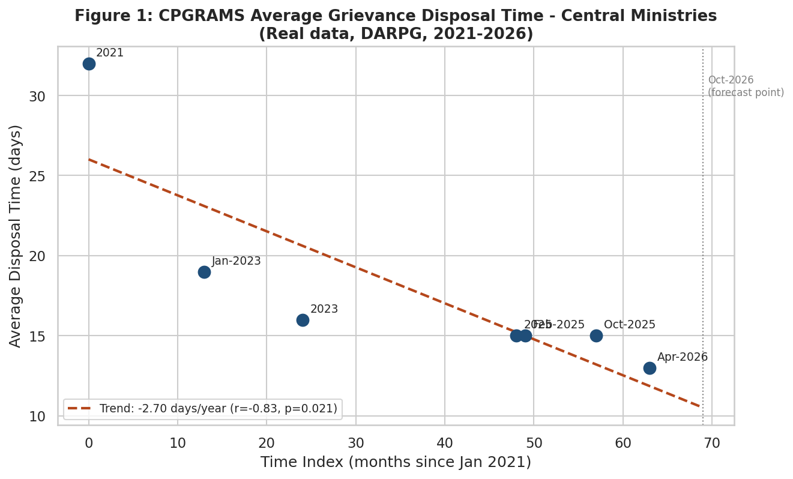
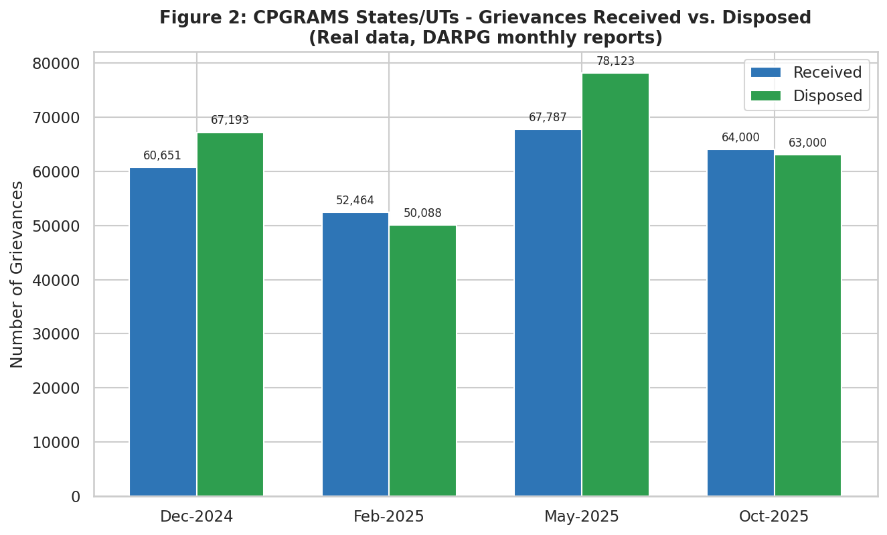
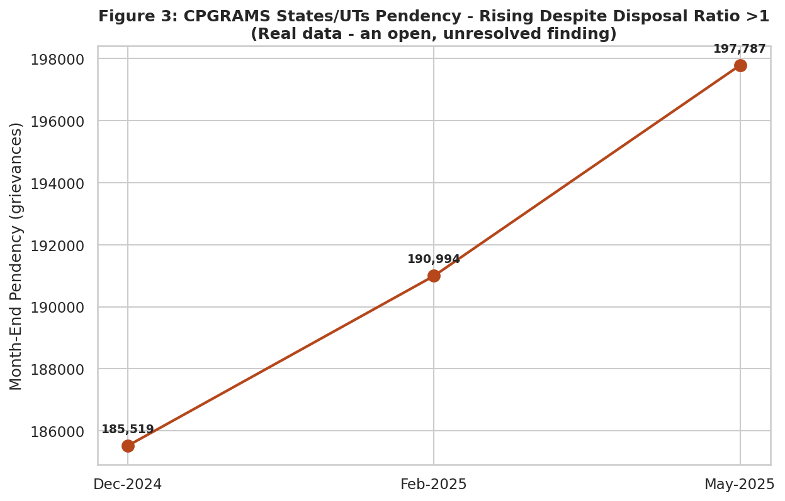

<div align="center">

# 🎓 Digital Transformation in E-Governance
### A Six-Week Capstone: Planning → Cleaning → EDA → Statistics → Forecasting → Synthesis

*Three government datasets. Six weeks. One question: does the rigor actually hold up when applied to something new?*


-orange)

**[📓 Notebook](notebooks/06_comprehensive_evaluation_cpgrams.ipynb) · [📊 Live Dashboard](index.html) · [📄 Full Report](docs/Week6_Final_Evaluation_Report.docx)**

</div>

---

## ✨ What is this project?

This is the **final, synthesizing report** of a six-week Data Analyst Internship spanning India's
e-governance digital service ecosystem — strategic planning, data collection & cleaning,
exploratory data analysis, statistical analysis, and predictive modeling, all tied together here
into one coherent evaluation.

Rather than just summarizing prior work, this report runs a **validation exercise**: it applies
the exact same analytical habits developed across Weeks 1–5 — real-data-first sourcing, explicit
precision flagging, cautious trend extrapolation — to a **third, previously unused Government of
India resource**: DARPG's **Centralized Public Grievance Redress and Monitoring System
(CPGRAMS)**. If the approach only worked on the first two datasets, it wasn't a real methodology.

> 🔍 **What the validation found:** CPGRAMS grievance disposal time fell from 32 days (2021) to
> 13 days (April 2026) — a real, statistically significant trend (r=-0.83, p=0.021). But
> State/UT-level pendency *rose* 6.6% across the same window even while the disposal-to-received
> ratio averaged above 1.0. Fast disposal and shrinking backlog turned out to be two different
> things — exactly the kind of nuance this project's approach was built to catch.

## 🗂️ Three Resources, One Consistent Standard

| Weeks | Resource | Role |
|---|---|---|
| 1–4 | **UIDAI** Aadhaar enrollment records | Service efficiency & access equity (real, record-level) |
| 5 | **NPCI / PIB** UPI transaction statistics | Demand forecasting (real + transparently flagged gaps) |
| 6 | **DARPG / CPGRAMS** grievance data | Validation on unseen data (real, newly sourced) |

## 📋 The Six-Week Journey

| Week | Task | Dataset / Resource | Key Technique(s) | Deliverable |
|---|---|---|---|---|
| 1 | Strategic Planning | N/A (planning only) | KPI framework design, 6-stage pipeline | Strategic plan (DOC) |
| 2 | Data Collection & Cleaning | UIDAI (440,818 rows) + UMANG/DigiLocker | Missing-value/duplicate checks, bias audit | DOC + cleaned CSVs |
| 3 | Exploratory Data Analysis | UIDAI (440,817 cleaned rows) | Descriptive stats, 4 hypotheses, 6 visualizations | DOC + notebook + dashboard |
| 4 | Statistical Analysis | UIDAI (real) + DigiLocker rating (real anchor) + simulated satisfaction | Pearson correlation, OLS regression, Welch's t-test | DOC + notebook + dashboard |
| 5 | Predictive Modeling | NPCI / PIB UPI transaction volume | Linear regression, Holt's smoothing, log-linear growth | DOC + notebook + dashboard |
| 6 | **Comprehensive Evaluation** | **DARPG / CPGRAMS (new, 3rd resource)** | Synthesis, cross-phase critical analysis, validation regression | **This report** |

## 🧭 Critical Analysis — Strength Against Weakness, Not Listed Separately

| Phase | Strength | Weakness |
|---|---|---|
| Week 1 (Planning) | Anticipated real challenges (small-sample bias, source diversity) before they occurred | Written without real data — some assumptions only validated retroactively |
| Week 2 (Collection/Cleaning) | Every cleaning step backed by an exact, measured number (e.g. 24,340 rows affected) | Initial submission lacked a biases section — required a full revision cycle |
| Week 3 (EDA) | 4 hypotheses pre-registered before testing; 2 reported as NOT supported | All findings are correlational, aggregate-level — no causal claims testable |
| Week 4 (Statistics) | Real external anchor (DigiLocker rating) for the one necessarily-simulated metric | High R² (0.782) was partly guaranteed by the simulation's own construction |
| Week 5 (Forecasting) | Compared two models and treated their disagreement as a genuine finding | Only 13 monthly points — too short to model real seasonality |
| Week 6 (Synthesis) | Validated the same habits on completely new data (real-anchor sourcing, precision flags) | The validation case study itself has only 7 and 4 data points — illustrative, not a full re-run |

**The clearest cross-phase pattern:** Week 2's initial submission scored 54/100 specifically for
lacking concrete numbers and a biases discussion. Every report from Week 3 onward — including this
one — built in a dedicated, evidence-backed limitations section from the start. That's not a
coincidence; it's a disclosed response to specific feedback, and it held even under new data.

## 📈 The CPGRAMS Validation Case Study

<table>
<tr>
<td width="33%"><br/><sub><b>Fig 1.</b> Disposal time falling: 32 → 13 days (r=-0.83, p=0.021)</sub></td>
<td width="33%"><br/><sub><b>Fig 2.</b> Monthly received vs. disposed, State/UT level</sub></td>
<td width="33%"><br/><sub><b>Fig 3.</b> Pendency still rising despite disposal keeping pace</sub></td>
</tr>
</table>

## 💡 Recommendations (Owner-Assigned, Not Generic)

| Recommendation | Impact | Owner |
|---|---|---|
| Target biometric-capture fixes for the 0–5 and 60+ age bands specifically (Week 3 finding) | High — addresses the largest, most specific rejection driver found | UIDAI / enrolment agencies |
| Treat digital-access expansion and enrolment-friction reduction as separate workstreams (Week 4 finding) | High — avoids wasted effort assuming one fixes the other | MeitY / State IT depts |
| Replace single-point growth-rate extrapolation with a logistic (S-curve) model for multi-year infrastructure planning (Week 5 finding) | High — prevents budget over-commitment from early hyper-growth rates | NPCI / RBI planning units |
| Investigate why CPGRAMS pendency keeps rising even when disposal exceeds intake (this report's finding) | Medium — a visible, measurable service-quality gap | DARPG |
| Adopt a standard "Precision" flag (exact vs. approximate) on every published government statistic reused for analysis | Medium — improves reliability of future downstream analysis | Data-publishing ministries |
| Establish a single, versioned historical bulk-download endpoint per platform (as UIDAI provides, unlike CPGRAMS/UPI) | High — the single biggest recurring obstacle across all 6 weeks | MeitY / NIC |

## 🗂️ Project Structure

```
.
├── README.md
├── requirements.txt
├── notebooks/
│   └── 06_comprehensive_evaluation_cpgrams.ipynb   ← full validation pipeline, executed (20 cells, 0 errors)
├── data/
│   ├── cpgrams_disposal_time_trend.csv              ← 7-point real disposal-time series (DARPG-sourced)
│   ├── cpgrams_states_monthly.csv                     ← State/UT monthly received/disposed/pendency
│   └── cpgrams_case_study_summary.csv                   ← headline validation statistics
├── assets/charts/                                       ← the 3 static chart exports above
├── dashboard/
│   └── digital_transformation_dashboard.html              ← self-contained interactive dashboard
└── docs/
    └── Week6_Final_Evaluation_Report.docx                  ← the full written capstone report
```

## 🚀 Getting Started

```bash
git clone <your-repo-url> && cd <repo-name>
python -m venv venv && source venv/bin/activate   # Windows: venv\Scripts\activate
pip install -r requirements.txt
jupyter notebook notebooks/06_comprehensive_evaluation_cpgrams.ipynb
```

## 🖥️ Interactive Dashboard

[`dashboard/digital_transformation_dashboard.html`](dashboard/digital_transformation_dashboard.html)
— fully self-contained (Plotly embedded inline, works offline). Covers the CPGRAMS disposal-time
trend, the received-vs-disposed comparison, and the pendency trend that motivates this report's
central validation finding.

## ⚠️ Limitations of This Internship's Analysis (Overall)

- No dataset used across all six weeks includes individual-citizen-level records with informed
  consent for research use — all analysis is on aggregated, publicly published figures.
- The CPGRAMS validation case study has only 7 disposal-time points and 4 monthly throughput
  points — enough to confirm the *approach* transfers, not enough for a full standalone study.
- None of the three government platforms (UIDAI, NPCI, CPGRAMS) provides a single versioned bulk
  historical download — every dataset required piecing together figures from separate releases.
- All statistical relationships found across the internship are correlational; none support a
  causal claim without further, individual-level research design.

## 🧰 Tech Stack

| Purpose | Library |
|---|---|
| Data handling | `pandas`, `numpy` |
| Statistical testing | `scipy` (correlation, regression) |
| Static visualization | `matplotlib`, `seaborn` |
| Interactive dashboard | `plotly` |
| Notebook environment | `jupyter`, `nbformat` |

## 📄 Data Attribution

Real data: **DARPG (Department of Administrative Reforms & Public Grievances), Government of
India** — CPGRAMS monthly and annual reports (2021–2026). This project also references prior
work using **UIDAI** and **NPCI/PIB** data (Weeks 1–5). This is an independent educational
analysis and is not affiliated with or endorsed by DARPG, UIDAI, NPCI, or the Government of India.

---

<div align="center">

**Built with 🧡 as the capstone of a six-week e-governance data analysis internship**

*Data Analyst Internship — Week 6 (Final): Comprehensive Evaluation and Reporting on Digital Transformation Insights*

</div>
